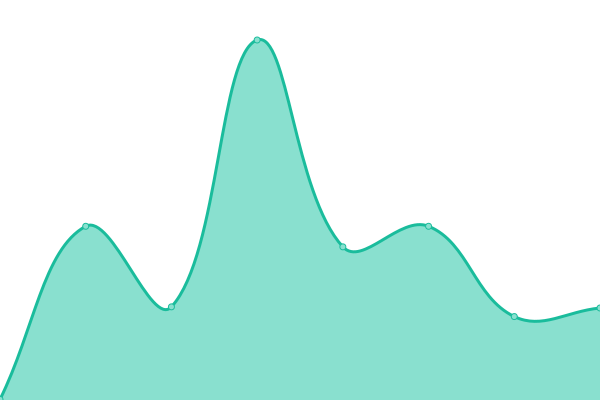

# [📈 Live Status](https://status.sant.sh): <!--live status--> **🟧 Partial outage**

This repository contains the open-source uptime monitor and status page for [Santosh](https://status.sant.sh), powered by [Upptime](https://github.com/upptime/upptime).

With [Upptime](https://upptime.js.org), you can get your own unlimited and free uptime monitor and status page, powered entirely by a GitHub repository. We use [Issues](https://github.com/sant-sh/status/issues) as incident reports, [Actions](https://github.com/sant-sh/status/actions) as uptime monitors, and [Pages](https://status.sant.sh) for the status page.

<!--start: status pages-->
<!-- This summary is generated by Upptime (https://github.com/upptime/upptime) -->
<!-- Do not edit this manually, your changes will be overwritten -->
<!-- prettier-ignore -->
| URL | Status | History | Response Time | Uptime |
| --- | ------ | ------- | ------------- | ------ |
|  Personal | 🟩 Up | [personal.yml](https://github.com/sant-sh/status/commits/HEAD/history/personal.yml) | 

 166ms
     
 | 

<a href="https://status.sant.sh/history/personal">100.00%</a>
    

|  Yunohost | 🟩 Up | [yunohost.yml](https://github.com/sant-sh/status/commits/HEAD/history/yunohost.yml) | 

 674ms
     
 | 

<a href="https://status.sant.sh/history/yunohost">100.00%</a>
    

|  HomeLab | 🟥 Down | [home-lab.yml](https://github.com/sant-sh/status/commits/HEAD/history/home-lab.yml) | 

 0ms
     
 | 

<a href="https://status.sant.sh/history/home-lab">0.00%</a>
    

|  Docker | 🟩 Up | [docker.yml](https://github.com/sant-sh/status/commits/HEAD/history/docker.yml) | 

 737ms
     
 | 

<a href="https://status.sant.sh/history/docker">100.00%</a>
    

<!--end: status pages-->

[**Visit our status website →**](https://status.sant.sh)

## 📄 License

- Powered by: [Upptime](https://github.com/upptime/upptime)
- Code: [MIT](./LICENSE) © [Santosh](https://status.sant.sh)
- Data in the `./history` directory: [Open Database License](https://opendatacommons.org/licenses/odbl/1-0/)
